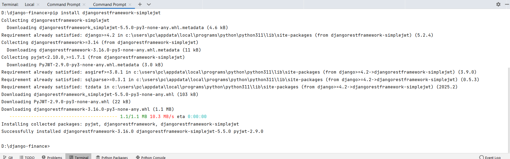

# django-finance
Django-based backend for the Finance App


# Setup Instructions

## 1. Install Django Framework
- Open the terminal and run the following command to install Django:
 
  ```bash
  pip install django
  ```
  

## 2. Create Project Structure
- Initialize a new Django project by running:
  
  ```bash
  django-admin startproject config .
  ```  

In this command, config is the name of the main project module, and the dot (.) specifies that the project should be created in the current directory.
  
## 3. Run the Development Server
- To start the local development server, use the following command:
 
  ```bash
  python manage.py runserver
  ```
  


- Result: 


# Install JWT Authentication

## 1. Install dj-rest-auth and djangorestframework-simplejwt
- Open the terminal and run the following command to install dj-rest-auth and djangorestframework-simplejwt:
 
  ```bash
  pip install dj-rest-auth
  pip install djangorestframework-simplejwt
  ```
 

## 2. Update settings.py with the following configurations:
 
  ```bash
  REST_AUTH = {
    'USE_JWT': True,
    'JWT_AUTH_COOKIE': 'djangojwtauth_cookie',
    'JWT_AUTH_REFRESH_COOKIE': 'djangojwtauth_refresh_cookie'
}

REST_FRAMEWORK = {
    'DEFAULT_AUTHENTICATION_CLASSES': (
        "dj_rest_auth.jwt_auth.JWTCookieAuthentication",
    ),
      
INSTALLED_APPS = [      
    
    'rest_framework',
    'rest_framework.authtoken',
]
}
  ```

## 3. Create a superuser account
 
  ```bash
  Username: admin

  Email: admin@mail.com

  Password: 123
  ```

## 4. Login to the admin panel
- Use the superuser's username and password to verify the authentication functionality.
 
 

# Development Flow

- We don't work directly on main or staging branch. We need to create a new branch for each task. The new branch should derive from **main** branch.

# Branching model

- Define how you want your branches to be named, and specify your development and production branches, to help us suggest source and target branches.

- Branch prefixes Define the default prefixes for new branches, to allow automated workflows and make branch types clearer.

  ## 1. Feature branch
 Used for specific feature work or improvements. Generally branches from, and merges back into the development branch, using pull requests.
- ```feature/Implement User Authentication Endpoints```

  ## 2. Bugfix branch
 Typically used to fix Release branches.
- ```bugfix/{{short-description}}```

   ## 3. Hotfix branch
 Used to quickly fix a Production branch without interrupting changes in the development branch. In a Gitflow-based workflow, changes are usually merged into the production and development branches.
- ```hotfix/{{short-description}}```

  # Commit Message
- ```Implement User Authentication Endpoints```

# Design Database Schema
- **Database Engine**: MySQL (using `django.db.backends.mysql` in Django settings)
    **Database Configuration:**
    + This project uses **MySQL** as its primary database. Make sure to configure your `settings.py` with the appropriate credentials:
      ```python
      DATABASES = {
          'default': {
              'ENGINE': 'django.db.backends.mysql',
              'NAME': 'your_db_name',
              'USER': 'your_db_user',
              'PASSWORD': 'your_db_password',
              'HOST': '',
          }
      }
    + Run the following to set up your schema:
      ```bash
      **python manage.py migrate**
      ```
- Erd Diagram:

- Models Overview
    + **Users**: Stores user details
    + **Categories**: Hierarchical transaction categories
    + **Transactions**: One-time financial transactions
    + **RecurringTransactions**: Automatically repeating transactions
    + **Settings**: User preferences
